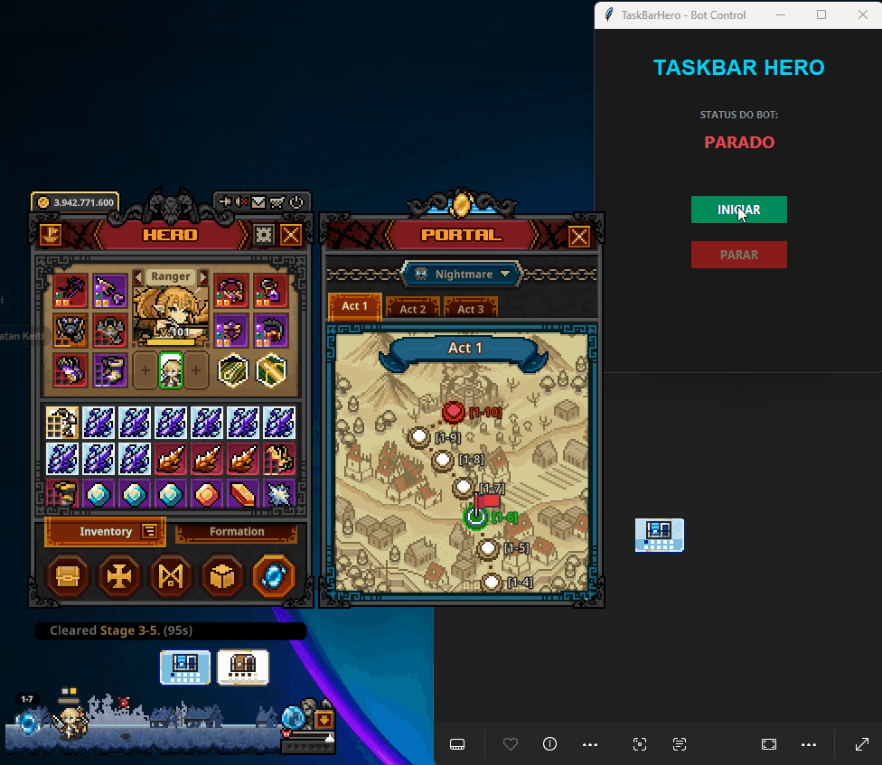

# 🤖 Taskbar Hero Auto-Bot (Python)

Uma ferramenta de automação desenvolvida em Python para otimizar a progressão no jogo **TBH: Task Bar Hero**, focando na navegação automática de estágios e abertura contínua de baús.

  

---

## 📌 Sobre o Projeto

O **Taskbar Hero** é um jogo idle RPG que roda na barra de tarefas. Para maximizar os ganhos e obter equipamentos melhores, é necessário farmar em estágios específicos focados na obtenção de **baús azuis** e abri-los constantemente.

Este bot foi criado para **automatizar a rotina de farm e abertura de baús**, utilizando visão computacional para reconhecer elementos da interface e simular ações de forma autônoma.

---

## 🚀 Funcionalidades

* ⚔️ **Farm de Estágios:** Seleciona e roda automaticamente os melhores estágios voltados para o ganho de **baús azuis**.
* 📦 **Abertura Automática de Baús:** Identifica e abre os baús acumulados sem necessidade de cliques manuais.
* 👁️ **Reconhecimento de Tela em Tempo Real:** Utiliza análise de imagem (*template matching*) para mapear os botões do jogo e o tipo de baú visível.
* ⏹️ **Atalhos de Segurança (Hotkeys):** Controles de teclado para iniciar, pausar e interromper a execução do bot a qualquer momento.

---

## 🛠️ Como Funciona (Lógica de Execução)

O bot opera em um fluxo contínuo estruturado da seguinte forma:

[ Captura de Tela ] ➔ [ Identificação do Estágio / Baú ] ➔ [ Decisão de Navegação ] ➔ [ Clique Automático ]

1. **Captura de Tela:** Monitora em tempo real a região onde o jogo está ativo.
2. **Matching de Imagem:** Compara o frame atual com imagens de referência (*templates*) dos botões dos melhores estágios e dos baús azuis.
3. **Execução:** Garante que o jogador permaneça no estágio correto de farm e realiza os cliques necessários para abrir os baús obtidos.

---

## 💻 Tecnologias Utilizadas

* **Python 3.x**
* **PyAutoGUI / OpenCV:** Captura de tela, processamento de imagem (*template matching*) e simulação de comandos do mouse.
* **Pillow (PIL):** Manipulação e leitura de imagens.
* **Keyboard / Pynput:** Leitura de atalhos globais de teclado para pausar ou encerrar o script.

---

## ⚠️ Isenção de Responsabilidade (Disclaimer)

Este projeto foi desenvolvido estritamente para **fins educacionais e de aprendizado** sobre visão computacional e automação de processos em Python. O script opera exclusivamente na camada de interface gráfica, sem realizar injeção de código ou alteração da memória do jogo.

